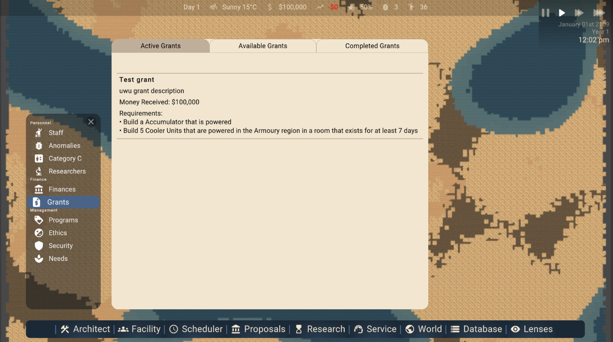
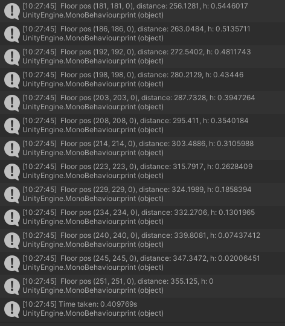
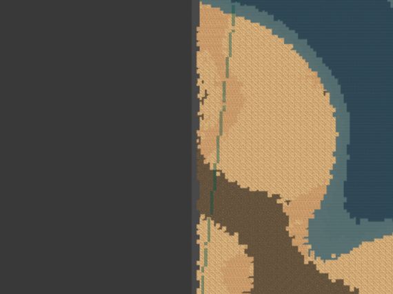

Welcome to Forensic Friday 35. Many moons ago, I mentioned we were going to start on gunplay around FF35, and well, I was pretty spot on. This was before the ⁠roadmap had been established too! Well, this week, I present to you the start of gunplay! This has been the main focus of this week, outside of finishing up grants which are now finished; aside from finalised UI styling. Well, no point waffling here, lets get the anomaly poll winner out of the way first! 

# Anomaly Poll Winner

The winner is.... **S-0083 - "The door to Anywhere" **, a very mysterious door that leads to places beyond comprehension. Awesome! Congrats to... noone, because we wrote all of them. HAHAHA! 

Expect a new case file on this anomaly in the next **Mechanical Monday**, which is mere days away! Here's it's description to jog your memory:

> An Isolated doorframe, with a bright blue door. By it's nature it's uncontainable, but has an affinity towards appearing near Facility grounds. When opened, the places it leads to vary widely. Sometimes it leads to places on earth, planets in the solar system, or far distance reaches of our observable universe. But occasionally, the door opens from the other side, revealing a dream world. A world beyond imagination and comprehension. Who or what opens it, is unknown, but whatever it is welcomes all to traverse its world, and the nightmares that lay within.

Look forward to the next poll where you can have a say in which anomalies will be implemented first!

# Catching Up with the Roadmap

We spent some of this week catching up with a feature we let slip through our hands: Grants! It ended up being a lot more technically demanding than we expected, much more work than a weekend! The good news is that it is pretty much done and dusted. All that is left is to improve the UI styling but it's not a major priority. The bad news however is that we are behind on** Prisoners Expanded**, by almost a week. That doesn't sound very great! Though we gave ourselves 6 weeks to work on those features, so there is still a bit of flexibility. Well...hopefully there is! Regardless, it will be started next week, without fail, so expect to get updates on that in **Forensic Friday 36!** You can take a peak at the UI for grants below, nothing too ground-breaking here...

# Projectiles & Bullets

This week I've been working on implementing projectiles to the game. Projectiles are physically modelled objects that take into account, air resistance, mass of the bullet, initial velocity amongst other various factors. This is all use to resolve the path in the world the projectile, or rather bullet, takes, and also how much damage it does on impact with hard bodies and soft bodies. Bullets also have a chance to ricochet, which depends on the hardness of the material. Bullets can also pass through certain objects if their material strength is too low! Currently tiles are  damaged when bullets pass through it, as will as when they are stopped by a material. Bullets also damage NPCs, interacting with the new body system. They are quite lethal! I also worked on creating visuals and sound for the projectiles which helps bring them to life, and definitely help with visualisation! Here are some videos below.

You may notice the lack of as "gunfire" sound, this is because these projectiles aren't being created by a weapon, but are rather spawned in from thin air! To any of you interested, here is some printouts of the trajectory resolver, plus a visualisation of the collision trace for bullets. One thing to note is that bullets travel at accurate speeds, thus are quite fast!

In this case it took less than half a second to travel many hundreds of metres! 

Marked areas are where the bullet could collide with entities, there is currently an issue with gaps forming, but this is an easily fixable issue (that I only just noticed now :0 ) 

# Inventory System

Another feature that we needed to work on this week, in preparation for the later features of gunplay, is an inventory system. In short, this allows NPCs to carry items, wear clothes, and wear items that increase inventory space such as backpacks etc. Almost all of this is on the simulation side of the game, so there isn't much, if anything to show! But I thought it would be worth mentioning it is a feature in the game! We promised to work on 2.35 features every week to bring gunplay to life in time... we only finished 2, but! That .34 is a great excuse to do a bit of work on the weekend! Much fun! Anyways, that's all I could think to write about that...

# Case Closed

...And so it seems we are reaching the end of this **Forensic Friday!!!** Short and sweet, just how we like it. The next following weeks will likely be much the same, mostly because we are dedicating a **lot** of time to a *few* features, as these features we will tackle in the upcoming weeks are quite integral to the core gameplay as a whole. Especially **PRISONERS**. We don't really know if they will continue to be prisoners, maybe more like (involuntary) "volunteers", but that's just a lore rewrite. As much as the gameplay is concerned, they are prisoners in ***your*** facility at least. Perhaps your employees too are? Maybe we are getting too deep here, time to close the case! See you next Monday! Ciao 

**Thanks for reading,**\
**The Team,**\
**Plasmarc Studios**
